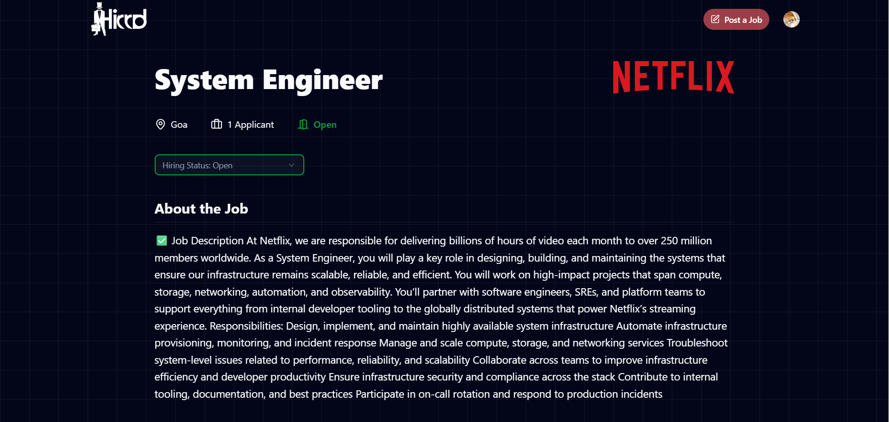

# 🌐 Hirrd – Job Portal

**Hirrd** is a modern, full-stack Job Portal web app built with **React.js**, **Supabase**, and **Clerk**.  
It enables recruiters to post jobs and manage listings, while job seekers can browse, save, and apply easily — all with secure, role-based authentication.

---

## ✨ Features

✅ **Secure Authentication with Clerk**  
- Sign-up / Login for Recruiters and Job Seekers  
- Role-based dashboards  

✅ **Job Posting & Management** *(Recruiter)*  
- Post new jobs with detailed info  
- View and manage posted jobs  

✅ **Job Search & Apply** *(Job Seeker)*  
- Browse all available jobs  
- Apply directly from the portal  
- Save jobs to view later  

✅ **Responsive UI**  
- Fully responsive design for desktop, tablet, and mobile  

✅ **Real-time Database with Supabase**  
- Instant updates on job listings  
- Scalable and secure backend  

✅ **Modern Frontend with React**  
- Clean, dynamic user interface  
- Smooth navigation and component-based structure  

---

## 🛠️ Tech Stack

- **Frontend:** React.js  
- **Authentication:** Clerk.dev  
- **Backend / Database:** Supabase (PostgreSQL)  
- **Styling:** CSS / Tailwind (optional, replace with what you use)  
- **Deployment:** Vercel / Netlify / GitHub Pages  

---

## 📸 Screenshots

| Login / Register | Recruiter Dashboard | Job Listings | Job Details |
|-------------------|---------------------|---------------|-------------|
|  |  |  |  |

*(Replace these with your actual screenshots in a `/screenshots` folder)*

---

## 🌐 Live Demo

👉 [Live Website](https://hirrd-job-portal1.netlify.app/) *(replace with your actual deployed link)*

---

## 💻 GitHub Repository

👉 [GitHub Repository](https://github.com/Gautamjha321/Job-Portal) *(replace with your repo link)*

---

## ⚙️ Installation & Local Setup

1️⃣ Clone the repository
```bash
https://github.com/Gautamjha321/Job-Portal.git

2️⃣ Install dependencies

bash
Copy
Edit
npm install
3️⃣ Configure environment variables

Create a .env file in the root folder with:

VITE_SUPABASE_URL=your-supabase-url
VITE_SUPABASE_ANON_KEY=your-supabase-anon-key
VITE_CLERK_PUBLISHABLE_KEY=your-clerk-frontend-key

4️⃣ Start the development server

bash
Copy
Edit
npm run dev

🚀 Deployment
Deploy on Vercel, Netlify, or GitHub Pages.

Add environment variables in your deployment settings.

Build and deploy in a single click!

🤝 Contributing
Contributions, issues, and feature requests are welcome!
Feel free to fork the repo and open a pull request.

📜 License
This project is licensed under the MIT License.
Free to use, modify, and share.

